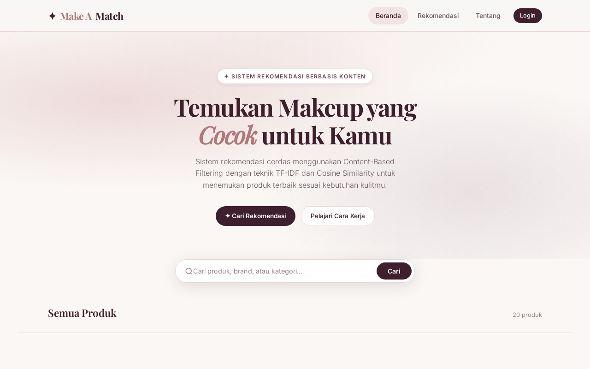
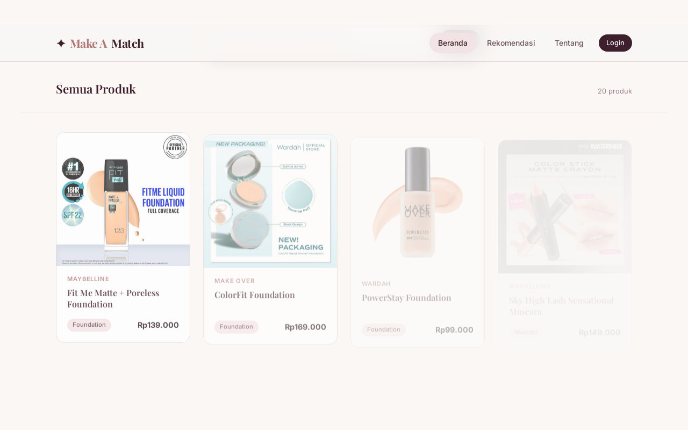
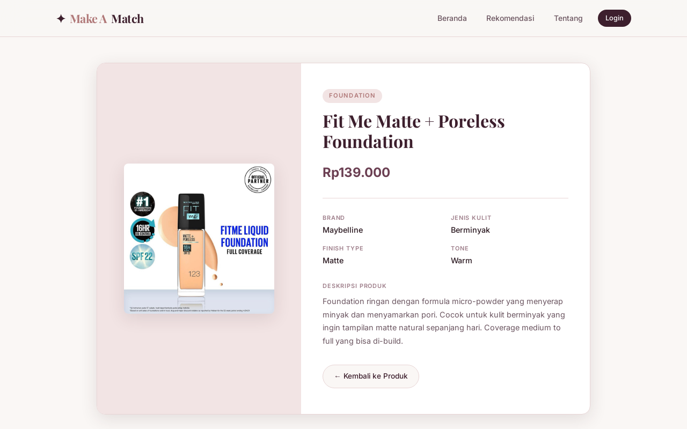
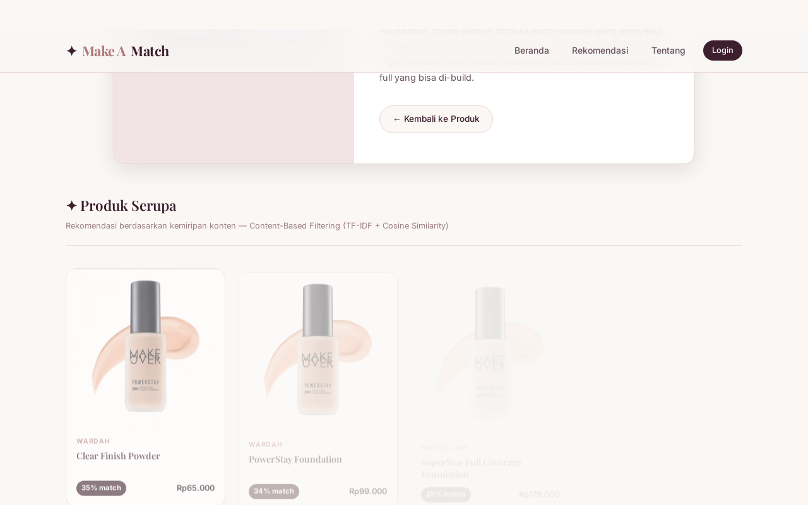
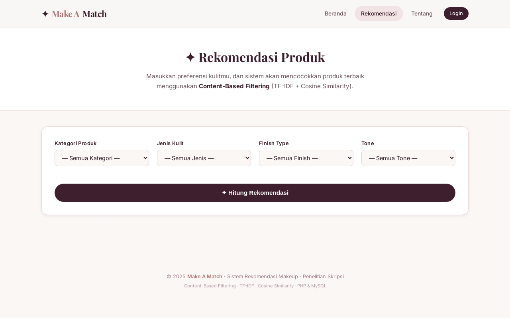
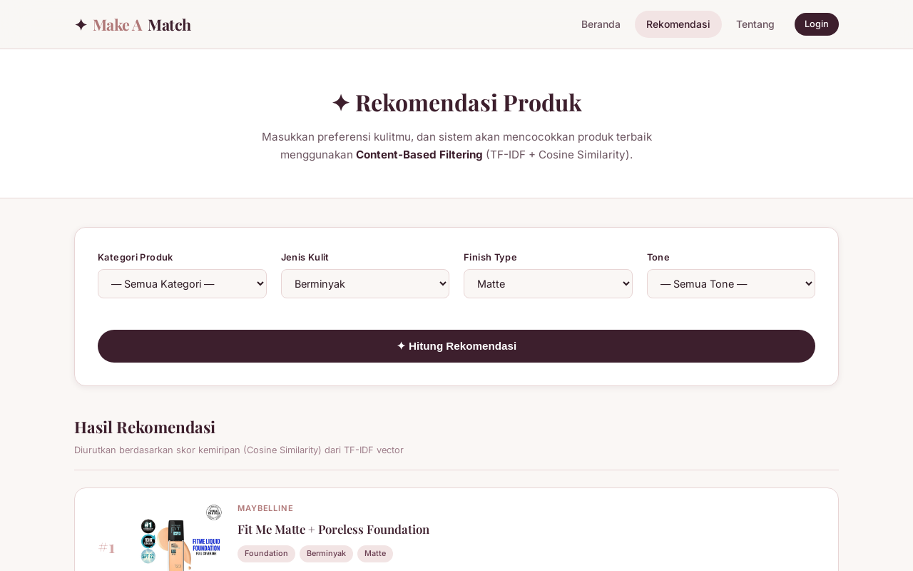
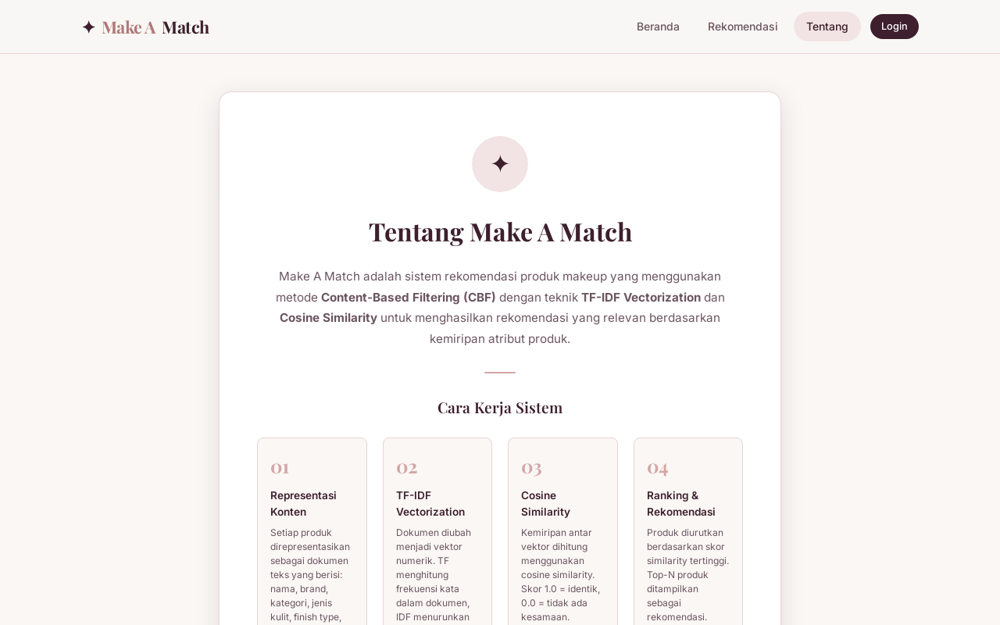

# Make A Match

**Sistem Rekomendasi Makeup berbasis Content-Based Filtering**

> Membantu menemukan produk makeup yang paling cocok dengan kebutuhan kulit kamu — cukup pilih preferensi, sistem akan mencocokkan secara otomatis menggunakan algoritma TF-IDF dan Cosine Similarity.

---

## Tampilan Aplikasi

### Beranda


### Katalog Produk


### Detail Produk


### Rekomendasi Produk Serupa (dengan skor kemiripan)


### Form Preferensi


### Hasil Rekomendasi (TF-IDF + Cosine Similarity)


### Tentang Sistem dan Algoritma


---

## Tentang Proyek Ini

**Make A Match** adalah sistem rekomendasi produk makeup yang dibangun sebagai bagian dari penelitian skripsi. Sistem ini menggunakan metode **Content-Based Filtering (CBF)** — sebuah teknik rekomendasi yang menganalisis atribut konten produk untuk menemukan kemiripan.

### Bagaimana Cara Kerjanya?

Bayangkan kamu punya 20 produk makeup. Setiap produk punya "kartu identitas" berisi kategori, jenis kulit, finish type, tone, dan deskripsi. Sistem ini melakukan 4 langkah:

1. **Mengubah teks jadi angka** — Setiap atribut produk diubah menjadi vektor numerik menggunakan teknik TF-IDF (Term Frequency - Inverse Document Frequency). Kata yang unik mendapat bobot tinggi, kata yang terlalu umum (seperti "dan", "yang") bobotnya diturunkan.

2. **Menghitung frekuensi kata (TF)** — Berapa kali sebuah kata muncul dalam satu produk, dibagi total kata di produk tersebut.

3. **Menghitung keunikan kata (IDF)** — Kata yang muncul di semua produk dianggap kurang penting. Kata yang hanya muncul di beberapa produk dianggap lebih informatif.

4. **Menghitung kemiripan (Cosine Similarity)** — Dua vektor dibandingkan menggunakan rumus cosine. Hasilnya berupa skor 0-100%. Semakin tinggi, semakin mirip produknya.

### Fitur Utama

- **Rekomendasi Berdasarkan Preferensi** — Pilih jenis kulit, finish type, kategori, dan tone, lalu sistem hitung produk paling cocok
- **Rekomendasi Produk Serupa** — Di halaman detail, tampilkan 5 produk paling mirip beserta skor match-nya
- **Pencarian** — Cari produk berdasarkan nama, brand, atau kategori
- **Admin Panel** — Tambah, edit, dan hapus produk melalui dashboard admin
- **Visualisasi Algoritma** — Penjelasan langkah-langkah cara kerja sistem di halaman Rekomendasi

---

## Cara Install

### Yang Dibutuhkan

Kamu butuh 3 hal di komputer/server kamu:

| Komponen | Fungsi |
|----------|--------|
| **PHP 8.0+** | Bahasa pemrograman backend |
| **MySQL / MariaDB** | Database untuk menyimpan produk |
| **Apache / Nginx** | Web server untuk menjalankan PHP |

### Langkah 1 — Install Software

**Ubuntu / Debian:**

```
sudo apt update
sudo apt install php php-mysqli php-mbstring mariadb-server apache2 libapache2-mod-php
```

**Windows (pakai XAMPP):**

Download dan install dari https://www.apachefriends.org . XAMPP sudah termasuk PHP, MySQL, dan Apache dalam satu paket.

**macOS:**

```
brew install php mariadb apache2
```

### Langkah 2 — Download Proyek

```
git clone https://github.com/ferah1223/makeup-cbf.git
cd makeup-cbf
```

Atau download ZIP dari GitHub lalu ekstrak.

### Langkah 3 — Buat Database

Login ke MySQL:

```
sudo mysql -u root
```

Jalankan file schema untuk membuat database dan mengisi 20 data sample:

```
sudo mysql < database/schema.sql
```

Atau kalau pakai XAMPP, buka phpMyAdmin, klik Import, pilih file `database/schema.sql`.

### Langkah 4 — Buat User Database

Masih di MySQL, jalankan perintah berikut satu per satu:

```
CREATE USER 'makeup_user'@'localhost' IDENTIFIED BY 'makeup_pass_2025';
GRANT ALL PRIVILEGES ON db_makeup.* TO 'makeup_user'@'localhost';
FLUSH PRIVILEGES;
EXIT;
```

**Catatan:** Kalau untuk development lokal, kamu bisa ganti isi file `includes/koneksi.php` sesuai credential MySQL kamu. Cari baris koneksi database dan ganti username serta password-nya.

### Langkah 5 — Jalankan

**Apache:** Copy folder proyek ke `/var/www/html/` atau konfigurasi virtual host.

**XAMPP:** Copy folder ke `htdocs/`, lalu buka `http://localhost/makeup-cbf/` di browser.

**PHP built-in server (untuk testing cepat):**

```
cd makeup-cbf
php -S localhost:8080
```

Lalu buka `http://localhost:8080` di browser.

### Langkah 6 — Login Admin

Buka `http://localhost/admin/login.php`:

- **Username:** `admin`
- **Password:** `admin123`

Dari sini kamu bisa menambah, mengedit, atau menghapus produk.

---

## Struktur Proyek

```
makeup-cbf/
├── index.php                ← Beranda + katalog produk
├── detail.php               ← Detail produk + rekomendasi CBF
├── rekomendasi.php          ← Form preferensi + hasil rekomendasi
├── tentang.php              ← Penjelasan sistem dan algoritma
│
├── admin/
│   ├── login.php            ← Login admin
│   ├── index.php            ← Dashboard + tabel produk
│   ├── tambah.php           ← Form tambah produk
│   ├── edit.php             ← Form edit produk
│   ├── hapus.php            ← Hapus produk
│   └── logout.php           ← Logout
│
├── includes/
│   ├── header.php           ← Template navbar (HTML head)
│   ├── footer.php           ← Template footer
│   ├── koneksi.php          ← Konfigurasi database
│   └── cbf.php              ← CBF Engine (TF-IDF + Cosine Similarity)
│
├── css/style.css            ← Design system
├── js/main.js               ← Mobile menu + animasi
├── images/                  ← Gambar produk
├── database/schema.sql      ← Schema + 20 data sample
└── README.md
```

---

## Tech Stack

| Layer | Teknologi |
|-------|-----------|
| Backend | PHP 8.1 (native, tanpa framework) |
| Database | MySQL / MariaDB |
| Frontend | HTML5, CSS3, Vanilla JavaScript |
| Algoritma | TF-IDF Vectorization + Cosine Similarity |
| Server | Apache 2.4 |
| Auth | PHP Session + bcrypt |

Tidak ada dependency eksternal — murni PHP + MySQL + CSS + HTML + JS.

---

## Spesifikasi Penelitian

| Aspek | Detail |
|-------|--------|
| Metode | Content-Based Filtering |
| Teknik | TF-IDF + Cosine Similarity |
| Atribut | Kategori, Jenis Kulit, Finish Type, Tone, Deskripsi |
| Dataset | 20 produk makeup (sample testing) |
| Output | Ranking produk berdasarkan skor kemiripan (0-100%) |

---

## Lisensi

Proyek ini dikembangkan untuk penelitian skripsi. Silakan digunakan sebagai referensi.
